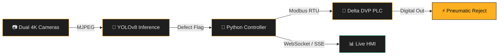
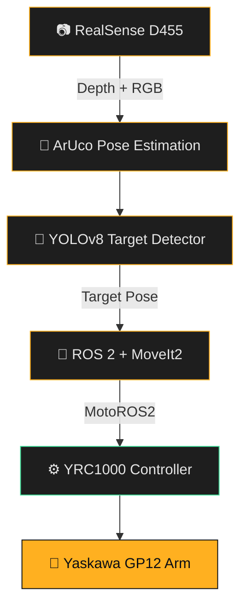

<div align="center">


<a href="https://git.io/typing-svg">
  
</a>

<br/>


<br/><br/>

<a href="https://linkedin.com/in/ombhagwat18"></a>
<a href="mailto:ombhagwat18@gmail.com"></a>
<a href="https://github.com/ombhagwat18"></a>

</div>

<br/>

<table>
<tr>
<td width="60%" valign="top">

### ⚙️ System Manifest

```yaml
engineer:
  designation : Robotics & Automation Engineer
  institution : K.K. Wagh Institute of Engineering, Nashik
  degree      : B.Tech, Robotics & Automation (Final Year)
  based_in    : Nashik, Maharashtra, IN

  domains:
    - Industrial Robotics        → ROS 2 · MoveIt2 · MotoROS2
    - Machine Vision             → YOLOv8 · OpenCV · RealSense
    - PLC / SCADA Automation     → Delta DVP · Siemens S7 · Modbus
    - Edge AI Deployment         → ONNX · TensorRT
    - Mechanical Design          → SolidWorks · Fusion 360

  currently_building : >
    AI inspection + robotic pick-place systems that run
    unattended on real conveyor lines, not just in Gazebo.

  status : ONLINE — evaluating Robotics / CV / Automation roles
```

</td>
<td width="40%" valign="top" align="center">


<br/>
<sub>6-DOF industrial arm — same class I program daily</sub>

<br/><br/>


</td>
</tr>
</table>

---

## 🏭 Engineering Domains

<div align="center">

<table>
<tr>
<th>Domain</th><th>What I Do</th><th>Stack</th>
</tr>
<tr>
<td><b>🦾 Industrial Robotics</b></td>
<td>6-DOF motion planning, inverse kinematics, kinematic tree design</td>
<td><code>Yaskawa GP12</code> <code>ROS 2 Humble</code> <code>MoveIt2</code> <code>MotoROS2</code></td>
</tr>
<tr>
<td><b>👁️ Machine Vision</b></td>
<td>Real-time defect detection, ArUco pose estimation, calibration</td>
<td><code>YOLOv8</code> <code>OpenCV</code> <code>RealSense D455</code></td>
</tr>
<tr>
<td><b>⚙️ Industrial Automation</b></td>
<td>Ladder logic, protocol bridging, SCADA telemetry</td>
<td><code>Delta DVP14SS</code> <code>Siemens S7</code> <code>Modbus RTU/TCP</code></td>
</tr>
<tr>
<td><b>🔌 Embedded / Edge AI</b></td>
<td>Firmware, real-time control loops, model optimization</td>
<td><code>ESP32</code> <code>Raspberry Pi</code> <code>ONNX</code> <code>TensorRT</code></td>
</tr>
<tr>
<td><b>📐 CAD & Mechanical</b></td>
<td>Enclosure design, robotic cell layout, sheet-metal fabrication</td>
<td><code>SolidWorks</code> <code>Fusion 360</code> <code>AutoCAD</code></td>
</tr>
<tr>
<td><b>🖥️ Industrial HMI</b></td>
<td>Live telemetry dashboards for production-floor monitoring</td>
<td><code>Flask</code> <code>WebSockets</code> <code>SSE</code></td>
</tr>
</table>

</div>

---

## 🚀 Flagship Deployments

<details open>
<summary><b>🍾 BottleGuardPro — AI Defect Inspection System</b> &nbsp; </summary>
<br/>

> Vision-guided quality inspection running live on a Bisleri bottling conveyor — full closed loop from camera to pneumatic reject.



| Spec | Detail |
|---|---|
| Vision | Dual EMEET 4K, LAB-calibrated LED chamber |
| Inference | Custom YOLOv8 · 50+ defect classes · <12 ms/frame |
| Control | Delta DVP14SS via RS-232 Modbus RTU |
| HMI | Live SPC charts, false-positive retrain loop |

`Python` `OpenCV` `YOLOv8` `Flask` `PyQt5` `Delta PLC` `Modbus RTU`

<a href="https://github.com/ombhagwat18/Bottle_Defect_Detection_System"></a>

</details>

<details open>
<summary><b>🤖 Vision-Guided Pick & Place — Yaskawa GP12</b> &nbsp; </summary>
<br/>

> Autonomous 6-DOF pick-and-place cell fusing depth perception with industrial motion control.



| Spec | Detail |
|---|---|
| Arm | Yaskawa Motoman GP12 · 12 kg payload · YRC1000 |
| Perception | RealSense D455 depth + ArUco pose extraction |
| Planning | ROS 2 Humble + MoveIt2, custom URDF/SRDF & DH tuning |
| Sim | Gazebo physics + RViz2 trajectory visualization |

`ROS 2 Humble` `MoveIt2` `MotoROS2` `RealSense D455` `OpenCV` `C++`

</details>

<details>
<summary><b>🛣️ Autoscanx — AI Pothole & Canal Inspection Vehicle</b> &nbsp; </summary>
<br/>

- ESP32 telemetry streamed live to a PyQt5 desktop GUI
- Real-time canvas, map overlays, anomaly logging, remote override
- CV pipeline classifying surface flaws and depth irregularities

`ESP32` `PyQt5` `OpenCV` `Python`

</details>

<details>
<summary><b>🌱 Autonomous Weed Detection Robot</b> &nbsp; </summary>
<br/>

- PiCamera2 real-time weed boundary segmentation
- Dual L298N drive + relay-actuated cutter and spray solenoid
- Flask portal with live stream + GPIO control panel

`Raspberry Pi 4` `Python` `OpenCV` `Flask`

</details>

<details>
<summary><b>🐾 Smart Feeding & Daycare Automation</b> &nbsp; </summary>
<br/>

- Flask server driving precision PWM servo dispensers
- Live device status via Server-Sent Events, no page refresh

`Raspberry Pi Zero W` `Flask` `SSE`

</details>

<br/>

<div align="center">

<a href="https://github.com/ombhagwat18/VisionArch"></a>
<a href="https://github.com/ombhagwat18/Camsnap"></a>
<a href="https://github.com/ombhagwat18/OEE_software-"></a>

</div>

---

## 🛠️ Tech Arsenal

<p align="center">
  
</p>

<div align="center">


<br/>


</div>

---

## 📊 Live Analytics

<div align="center">


<br/>


<br/>


<br/>


<!--START_SECTION:waving-snake-->

<!--END_SECTION:waving-snake-->

</div>

---

## 🎓 Education & Certifications

<div align="center">

| Institution / Platform | Credential | Status |
|---|---|---|
| 🎓 K.K. Wagh Institute of Engineering, Nashik | B.Tech — Robotics & Automation Engineering | 🟡 Final Year |
| 🤖 DeepLearning.AI / Coursera | Machine Learning Specialization | ✅ |
| 🧠 Google / Coursera | Generative AI Fundamentals | ✅ |
| ⚙️ Industrial Automation Institute | PLC & SCADA Programming | ✅ |
| 🤖 The Construct / Udemy | ROS & ROS 2 Development | ✅ |
| 🔌 Embedded Systems Certification | ESP32 / Arduino / Raspberry Pi | ✅ |

</div>

---

## 💼 Experience Timeline

```text
2024        Armstrong Dematic, Nashik — Automation & Robotics Intern
            └─ Vision-guided GP12 pick & place — ROS 2 · MoveIt2 · MotoROS2 · RealSense D455

2023-24     BottleGuardPro — Industrial Project Lead
            └─ YOLOv8 · Delta PLC · Modbus RTU · OpenCV · Flask HMI

2023        Codephoton — Software Developer Intern
            └─ ESP32 IoT garbage-van monitoring, web dashboard, telemetry ingestion

2022-23     Competitions & Prototypes
            └─ Roborace ESP32 autonomous chassis · Autoscanx inspection vehicle · Weed-cutting robot
```

---

## 🏅 Recognition

- 🏁 Roborace builder — custom ESP32 obstacle-avoidance rover chassis
- 🤖 Facilitated hands-on ROS/microcontroller workshops
- 🏆 Deployed end-to-end vision-to-PLC control loop live on a production line
- 🎯 Selected for Armstrong Dematic's Automation & Robotics R&D internship

---

## ❓ FAQ

<details>
<summary><b>What roles am I looking for?</b></summary><br/>
Robotics Engineering, ROS 2 development, Computer Vision / AI Engineering, and Industrial Automation roles.
</details>

<details>
<summary><b>Hardware, software, or both?</b></summary><br/>
Both — I connect full-stack software (Python, C++, ROS 2, PyTorch) to physical systems (industrial arms, PLCs, ESP32, pneumatics, depth cameras).
</details>

<details>
<summary><b>Open to collaboration?</b></summary><br/>
Yes — reach out for open-source ROS 2 packages, vision pipelines, or automation projects.
</details>

---

<div align="center">

> *"Engineering is turning 'what if?' into 'it works.'"*

<a href="mailto:ombhagwat18@gmail.com"></a>
<a href="https://linkedin.com/in/ombhagwat18"></a>
<a href="https://github.com/ombhagwat18"></a>

<br/><br/>


**⭐ Star my repos if any of this is useful to you!**

</div>
