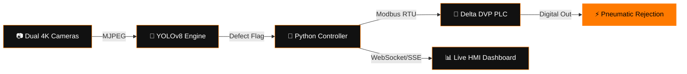
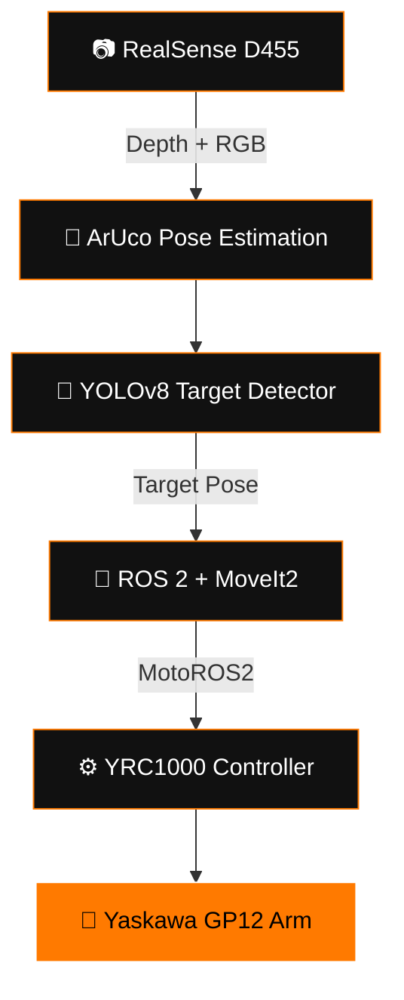

<div align="center">


<a href="https://git.io/typing-svg">
  
</a>

<br/>

<p>
  <a href="#-about-me"></a>
  <a href="#-flagship-projects"></a>
  <a href="#%EF%B8%8F-tech-arsenal"></a>
  <a href="#-github-analytics"></a>
  <a href="#-experience-timeline"></a>
  <a href="#-lets-build-something"></a>
</p>

<p>
  <a href="https://linkedin.com/in/ombhagwat18" target="_blank"></a>
  <a href="mailto:ombhagwat18@gmail.com"></a>
  <a href="https://github.com/ombhagwat18" target="_blank"></a>
  
  
</p>

</div>

---

## ⚙️ About Me

<table>
<tr>
<td width="55%" valign="top">

```yaml
engineer:
  name: Om Dilip Bhagwat
  title: Robotics & Automation Engineer | AI/ML + Computer Vision
  degree: B.Tech, Robotics & Automation Engineering (Final Year)
  institute: K.K. Wagh Institute of Engineering, Nashik
  location: Nashik, Maharashtra, India

  stack:
    robotics:   [ROS 2 Humble, MoveIt2, MotoROS2, Gazebo, RViz2]
    vision:     [YOLOv8, OpenCV, RealSense D455, ONNX/TensorRT]
    automation: [Delta DVP, Siemens S7, Modbus RTU/TCP, SCADA]
    embedded:   [ESP32, Raspberry Pi, Arduino]

  mission: >
    Bridging AI perception with industrial hardware to build
    autonomous machines that inspect, move, and decide in
    real time — on real production floors, not just in sim.

  status: "⚡ ONLINE — open to Robotics / CV / Automation roles"
```

</td>
<td width="45%" valign="top" align="center">


<sub>6-DOF arm — the same class of machine I program at work</sub>

</td>
</tr>
</table>

---

## 🏭 Core Competency Matrix

<div align="center">

| 🎯 Domain | Core Expertise | Hardware / Frameworks |
|---|---|---|
| **Industrial Robotics** | Motion planning, IK, URDF/SRDF | Yaskawa GP12, ROS 2 Humble, MoveIt2, MotoROS2 |
| **Computer Vision** | Detection, ArUco pose, defect inspection | YOLOv8, OpenCV, RealSense D455, EMEET 4K |
| **Industrial Automation** | PLC logic, SCADA, protocol bridging | Delta DVP14SS, Siemens S7, Modbus RTU/TCP |
| **Embedded & Edge AI** | Firmware, telemetry, real-time control | ESP32, Raspberry Pi, Arduino, TensorRT/ONNX |
| **CAD & Mechanical** | Enclosure design, robot cell layout | SolidWorks, Fusion 360, AutoCAD |
| **Web HMI / Dashboards** | Live industrial telemetry UIs | Flask, WebSockets, Server-Sent Events |

</div>

---

## 🚀 Flagship Projects

<details open>
<summary><b>🍾 BottleGuardPro — AI Bottle Inspection System</b> <code>DEPLOYED ON LINE</code></summary>
<br/>

> High-speed AI defect-detection system running live on a Bisleri bottling conveyor.

<a href="https://github.com/ombhagwat18/Bottle_Defect_Detection_System" target="_blank"></a>



| Feature | Spec |
|---|---|
| Vision | Dual EMEET 4K, LAB-calibrated LED lighting chamber |
| Inference | Custom-trained YOLOv8, 50+ defect classes, <12 ms/frame |
| Control | Delta DVP14SS via RS-232 Modbus RTU, pneumatic reject trigger |
| HMI | Live SPC charts, false-positive feedback retrain loop |
| Build | Custom CAD-designed C-bend sheet-metal enclosure |

**Stack:** `Python` `OpenCV` `YOLOv8` `Flask` `PyQt5` `Delta PLC` `Modbus RTU` `ESP32`

</details>

<details open>
<summary><b>🤖 Vision-Guided Pick & Place — Yaskawa GP12</b> <code>Armstrong Dematic Internship</code></summary>
<br/>

> Autonomous 6-DOF pick-and-place cell combining depth vision with industrial motion control.



| Component | Implementation |
|---|---|
| Arm | Yaskawa Motoman GP12, 12 kg payload, YRC1000 controller |
| Perception | RealSense D455 depth + ArUco marker pose extraction |
| Planning | ROS 2 Humble + MoveIt2, custom URDF/SRDF & DH tuning |
| Simulation | Gazebo physics + RViz2 trajectory visualization |

**Stack:** `ROS 2 Humble` `MoveIt2` `MotoROS2` `RealSense D455` `OpenCV` `Python/C++`

</details>

<details>
<summary><b>🛣️ Autoscanx — AI Pothole & Canal Inspection Vehicle</b> <code>Field Tested</code></summary>
<br/>

- 📡 ESP32 telemetry streamed live to a PyQt5 desktop GUI
- 🖥️ Real-time canvas, map overlays, anomaly logging, remote override
- 🎯 CV pipeline classifying surface flaws and depth irregularities

**Stack:** `ESP32` `PyQt5` `OpenCV` `Python`

</details>

<details>
<summary><b>🌱 Autonomous Weed Detection Robot</b> <code>Agri-Tech</code></summary>
<br/>

- 🎯 PiCamera2 real-time weed boundary segmentation
- ⚙️ Dual L298N drive + relay-actuated cutter and spray solenoid
- 🌐 Flask portal with live stream + GPIO control panel

**Stack:** `Raspberry Pi 4` `Python` `OpenCV` `Flask`

</details>

<details>
<summary><b>🐾 Smart Feeding & Daycare Automation</b> <code>IoT System</code></summary>
<br/>

- 🌐 Flask server driving precision PWM servo dispensers
- 📊 Live device status via Server-Sent Events, no page refresh

**Stack:** `Raspberry Pi Zero W` `Flask` `SSE`

</details>

### 📂 More Repositories

<div align="center">

| Repo | Description |
|---|---|
| [**VisionArch**](https://github.com/ombhagwat18/VisionArch) | AI-powered industrial computer vision workstation for benchmarking & comparing vision models |
| [**Camsnap**](https://github.com/ombhagwat18/Camsnap) | Lightweight desktop app for computer vision dataset creation — 4K webcam, live preview, ROI cropping |
| [**OEE_software-**](https://github.com/ombhagwat18/OEE_software-) | Overall Equipment Effectiveness platform with dynamic constraint resolution & Six Big Losses TPM matrix |

</div>

---

## 🛠️ Tech Arsenal

<p align="center">
  
</p>

<div align="center">

| Layer | Tools |
|---|---|
| **ROS 2 Ecosystem** | ROS 2 Humble · MoveIt2 · MotoROS2 · Gazebo · RViz2 · URDF/SRDF |
| **AI & Vision** | YOLOv8 · OpenCV · PyTorch · TensorFlow · ONNX Runtime · TensorRT |
| **Automation** | Delta DVP · Siemens S7 · Modbus RTU/TCP · Ladder Logic · SCADA |
| **Embedded** | ESP32 · Raspberry Pi · Arduino · UART/SPI/I2C/PWM |
| **CAD** | SolidWorks · Fusion 360 · AutoCAD · BricsCAD |

</div>

---

## 📊 GitHub Analytics

<div align="center">


<br/>

</div>

<div align="center">
  
</div>

<div align="center">
  
</div>

<!--START_SECTION:waving-snake-->
<div align="center">
  
</div>
<!--END_SECTION:waving-snake-->

> 🔧 The snake above animates automatically once the `platane/snk` GitHub Action is added to this repo (see setup note at the bottom).

---

## 🎓 Education & Certifications

<div align="center">

| Institution / Platform | Credential | Status |
|---|---|---|
| 🎓 K.K. Wagh Institute of Engineering, Nashik | B.Tech — Robotics & Automation Engineering | 🟡 Final Year |
| 🤖 DeepLearning.AI / Coursera | Machine Learning Specialization | ✅ |
| 🧠 Google / Coursera | Generative AI Fundamentals | ✅ |
| ⚙️ Industrial Automation Institute | PLC & SCADA Programming | ✅ |
| 🤖 The Construct / Udemy | ROS & ROS 2 Development | ✅ |
| 🔌 Embedded Systems Certification | ESP32 / Arduino / Raspberry Pi | ✅ |

</div>

---

## 💼 Experience Timeline

```text
2024        Armstrong Dematic, Nashik — Automation & Robotics Intern
            └─ Vision-guided GP12 pick & place — ROS 2 · MoveIt2 · MotoROS2 · RealSense D455

2023-24     BottleGuardPro — Industrial Project Lead
            └─ YOLOv8 · Delta PLC · Modbus RTU · OpenCV · Flask HMI

2023        Codephoton — Software Developer Intern
            └─ ESP32 IoT garbage-van monitoring, web dashboard, telemetry ingestion

2022-23     Competitions & Prototypes
            └─ Roborace ESP32 autonomous chassis · Autoscanx inspection vehicle · Weed-cutting robot
```

---

## 🏅 Recognition

- 🏁 Roborace builder — custom ESP32 obstacle-avoidance rover chassis
- 🤖 Facilitated hands-on ROS/microcontroller workshops
- 🏆 Deployed end-to-end vision-to-PLC control loop live on a production line
- 🎯 Selected for Armstrong Dematic's Automation & Robotics R&D internship

---

## ❓ FAQ

<details>
<summary><b>What roles am I looking for?</b></summary><br/>
Robotics Engineering, ROS 2 development, Computer Vision / AI Engineering, and Industrial Automation roles.
</details>

<details>
<summary><b>Hardware, software, or both?</b></summary><br/>
Both — I connect full-stack software (Python, C++, ROS 2, PyTorch) to physical systems (industrial arms, PLCs, ESP32, pneumatics, depth cameras).
</details>

<details>
<summary><b>Open to collaboration?</b></summary><br/>
Yes — reach out for open-source ROS 2 packages, vision pipelines, or automation projects.
</details>

---

## 📬 Let's Build Something

<div align="center">

> *"Engineering is turning 'what if?' into 'it works.'"*

<a href="mailto:ombhagwat18@gmail.com"></a>
<a href="https://linkedin.com/in/ombhagwat18" target="_blank"></a>
<a href="https://github.com/ombhagwat18" target="_blank"></a>

<br/><br/>


**⭐ Star my repos if any of this is useful to you!**

</div>
