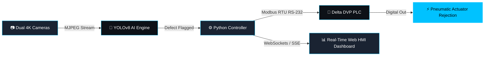
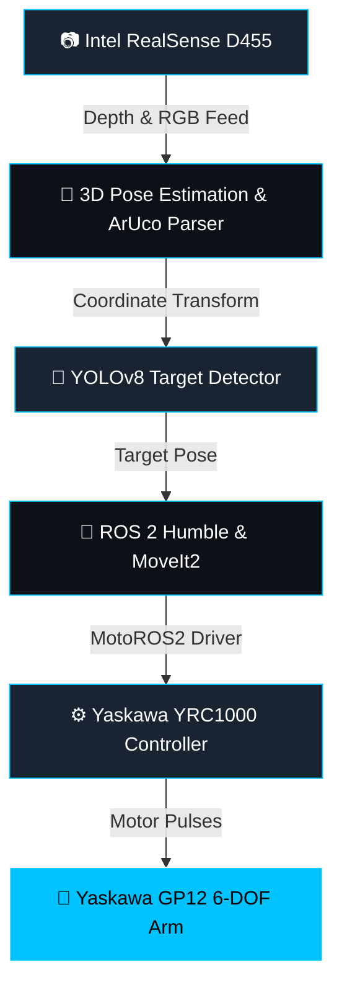

<div align="center">

<!-- Animated Dynamic Header Banner -->


<br/>

<!-- Typing SVG Animation -->
<a href="https://git.io/typing-svg">
  
</a>

<br/><br/>

<!-- Quick Navigation Pill Buttons -->
<p>
  <a href="#-about-me--system-telemetry"></a>
  <a href="#-flagship-projects"></a>
  <a href="#%EF%B8%8F-full-tech-stack--arsenal"></a>
  <a href="#-github-stats--analytics"></a>
  <a href="#-experience-timeline"></a>
  <a href="#-get-in-touch"></a>
</p>

<!-- Interactive Badges & Shields -->
<p>
  <a href="https://linkedin.com/in/ombhagwat18" target="_blank">
    
  </a>
  <a href="mailto:ombhagwat18@gmail.com">
    
  </a>
  <a href="https://github.com/ombhagwat18" target="_blank">
    
  </a>
  
  
</p>

</div>

---

## 🧠 About Me — System Telemetry & Terminal

```python
class RoboticsEngineer:
    def __init__(self):
        self.name            = "Bhagwat Om Dilip"
        self.role            = "Robotics & Automation Engineer | AI/ML Developer"
        self.institution     = "K.K. Wagh Institute of Engineering Education & Research, Nashik"
        self.degree          = "B.Tech — Robotics & Automation Engineering (Final Year)"
        self.location        = "Nashik, Maharashtra, India 🇮🇳"
        self.primary_stack   = ["ROS 2", "Python", "C++", "YOLOv8", "OpenCV", "LADDER (PLC)"]
        self.mission         = "Bridging AI & Industrial Hardware to Build Intelligent Autonomous Machines"

    def current_focus(self):
        return {
            "Industrial AI":    "Vision-Guided Robotics & High-Speed Quality Inspection",
            "Motion Control":   "ROS 2 Humble + MoveIt2 + MotoROS2 (Yaskawa GP12)",
            "Automation":       "PLC/SCADA Integration (Delta DVP, Siemens, Modbus RTU)",
            "Edge AI":          "Real-Time Defect Classification with TensorRT & ONNX",
            "Dashboard/HMI":    "Flask & WebSockets Industrial Monitoring Systems"
        }

    def system_status(self):
        return "⚡ STATUS: ONLINE | READY FOR INDUSTRIAL ROBOTICS & AI COLLABORATION"

engineer = RoboticsEngineer()
print(engineer.system_status())
# Output: ⚡ STATUS: ONLINE | READY FOR INDUSTRIAL ROBOTICS & AI COLLABORATION
```

---

## 🏭 Professional Competency Matrix

<div align="center">

| 🎯 Domain | 💡 Core Expertise | 🔧 Industrial Hardware & Frameworks | 🚀 Key Capabilities |
|---|---|---|---|
| **Industrial Robotics** | 6-DOF Robot Arms, Motion Planning, URDF/SRDF | Yaskawa Motoman GP12, ROS 2 Humble, MoveIt2, MotoROS2 | Trajectory Generation, Inverse Kinematics, RViz2 |
| **Computer Vision** | 2D/3D Perception, Object Detection, ArUco Calibration | YOLOv8, OpenCV, Intel RealSense D455, EMEET 4K | LAB Color Calibration, Defect Inspection (<15ms) |
| **Industrial Automation** | PLC Programming, SCADA Systems, Industrial Protocols | Delta DVP14SS, Siemens S7, Modbus RTU/TCP, RS-232/485 | Pneumatic Actuation, Conveyor Logic, KEPServerEX |
| **Embedded & Edge AI** | Firmware Architecture, Real-Time Telemetry, IoT | ESP32, Raspberry Pi 4/ZeroW, Arduino, L298N Drivers | Hardware Interfacing, PWM Control, FreeRTOS |
| **CAD & Mechanical Design** | Enclosure Fabrication, Robotic Cell Layout, URDF Meshes | SolidWorks, Fusion 360, AutoCAD, BricsCAD | C-Bend Sheet Metal, 3D Mesh Modeling |
| **Web HMI & Dashboards** | Industrial Real-Time Web Telemetry | Flask, HTML5/CSS3, WebSockets, Server-Sent Events | Live Video Streams, SPC Charts, Rejection Logs |

</div>

---

## 🚀 Flagship Projects

<details open>
<summary><b>🍾 Smart Bottle Inspection System — BottleGuardPro</b> <code>OPERATIONAL</code></summary>
<br/>

> **High-speed industrial AI-powered defect detection system deployed on a Bisleri bottle conveyor line**

<div align="center">



</div>

| Feature | Technical Specification |
|---|---|
| **Vision System** | Dual EMEET 4K cameras with LAB color-space calibrated LED lighting chamber |
| **AI Inference** | YOLOv8 model trained on custom dataset (50+ defect categories, <12ms processing time) |
| **PLC Control** | Delta DVP14SS via RS-232 Modbus RTU for real-time pneumatic rejection trigger |
| **HMI Dashboard** | Live statistical process control (SPC) charts, false-positive feedback retrain loop |
| **Enclosure** | Custom CAD designed & fabricated C-bend metal enclosure with safety door panel |

**Tech Stack:** `Python` · `OpenCV` · `YOLOv8` · `Flask` · `PyQt5` · `Delta PLC` · `Modbus RTU` · `ESP32`

</details>

<details open>
<summary><b>🤖 Vision-Guided Pick & Place — Yaskawa GP12 (Internship @ Armstrong Dematic)</b> <code>INDUSTRY PROJECT</code></summary>
<br/>

> **Autonomous 6-DOF industrial robot arm system with AI vision for dynamic pick-and-place operation**

<div align="center">



</div>

| Component | Technical Implementation |
|---|---|
| **Robot Arm** | Yaskawa Motoman GP12 (6-DOF, 12 kg payload) driven by YRC1000 Controller |
| **Perception** | Intel RealSense D455 depth sensor for 3D point cloud & ArUco marker pose detection |
| **Motion Planning** | ROS 2 Humble + MoveIt2 with custom URDF/SRDF & DH parameter tuning |
| **Simulation** | Gazebo physics simulation environment + RViz2 trajectory visualization |

**Tech Stack:** `ROS 2 Humble` · `MoveIt2` · `MotoROS2` · `Yaskawa GP12` · `RealSense D455` · `OpenCV` · `Python/C++`

</details>

<details>
<summary><b>🛣️ AI Pothole Detection & Canal Inspection Vehicle (Autoscanx)</b> <code>FIELD TESTED</code></summary>
<br/>

> **Autonomous ESP32-powered inspection vehicle with live PyQt5 GUI & real-time telemetry streaming**

- 📡 **Telemetry**: Low-latency MJPEG video over WiFi parsed directly into desktop GUI
- 🖥️ **PyQt5 Suite**: Real-time canvas rendering, map overlays, anomaly logger & remote override
- 🤖 **CV Engine**: Computer vision pipeline classifying surface flaws and depth irregularities

**Tech Stack:** `ESP32` · `PyQt5` · `OpenCV` · `Python` · `WiFi Telemetry`

</details>

<details>
<summary><b>🌱 Autonomous Weed Detection & Agricultural Robot</b> <code>AGRI-TECH</code></summary>
<br/>

> **Raspberry Pi mobile robot for real-time soybean field weed identification and mechanical cutting**

- 🎯 **Edge Vision**: PiCamera2 vision module running real-time weed boundary segmentation
- ⚙️ **Actuation**: Dual L298N motor driver + solid-state relay weed cutter & spray solenoid
- 🌐 **Remote Control**: Flask web portal displaying live camera stream & interactive GPIO controls

**Tech Stack:** `Raspberry Pi 4` · `Python` · `OpenCV` · `Flask` · `GPIO Hardware Control`

</details>

<details>
<summary><b>🐾 Dog Daycare Automation & Smart Feeding Suite</b> <code>IoT SYSTEM</code></summary>
<br/>

> **Raspberry Pi Zero W home automation server with real-time SSE event dashboard**

- 🌐 **Backend Logic**: Flask application triggering precision PWM servo food dispensers
- 📊 **Telemetry**: Server-Sent Events (SSE) providing live device status and log feeds without page refreshes

**Tech Stack:** `Raspberry Pi Zero W` · `Flask` · `SSE` · `HTML5/CSS3` · `PWM Servo Control`

</details>

---

## 🛠️ Full Tech Stack & Arsenal

### 💻 Core Programming Languages
<p>
  
</p>

---

### 🤖 Robotics & ROS 2 Ecosystem

<p>
  
</p>

| Framework / Tool | Specialized Application |
|---|---|
| **ROS 2 Humble** | Nodes, topic subscriptions, service servers, custom action client/server |
| **MoveIt2** | Kinematics solving, motion planning, trajectory execution, collision checking |
| **Gazebo / Ignition** | Realistic multi-body dynamics physics simulation & sensor plugin testing |
| **RViz2** | 3D state visualization, frame transforms (`tf2`), trajectory debugging |
| **MotoROS2** | Real-time driver communication interface for Yaskawa YRC1000 controller |
| **URDF / SRDF** | Detailed robot arm kinematic tree definition with validated DH matrices |
| **RealSense SDK** | Depth point cloud acquisition, alignment, spatial coordinate mapping |

---

### 🧠 AI, Computer Vision & Deep Learning

<p>
  
</p>

| Library | Industrial Function |
|---|---|
| **YOLOv8 (Ultralytics)** | High-speed bounding box detection, defect classification & instance segmentation |
| **OpenCV** | Image filtering, contours, ArUco markers, LAB/HSV color space calibration |
| **PyTorch / TensorFlow** | Custom dataset training pipelines, transfer learning & model tuning |
| **ONNX Runtime / TensorRT** | Model optimization for low-latency edge deployment on embedded vision systems |
| **NumPy & Pandas** | Data ingestion, dataset cleaning, statistical telemetry processing |

---

### ⚙️ Industrial Automation & Control Architecture

```
┌─────────────────────────────────────────────────────────────────────────┐
│                      INDUSTRIAL AUTOMATION MATRIX                       │
├────────────────────┬────────────────────┬───────────────────────────────┤
│   PLC PLATFORMS    │     PROTOCOLS      │        SCADA & HMI            │
│                    │                    │                               │
│  • Delta DVP14SS   │  • Modbus RTU/TCP  │  • Wonderware InTouch         │
│  • Siemens S7-1200 │  • RS-232 / RS-485  │  • KEPServerEX OPC-UA         │
│  • Schneider M221  │  • Ethernet/IP     │  • Custom Flask Web HMI       │
├────────────────────┼────────────────────┼───────────────────────────────┤
│    PROGRAMMING     │  ACTUATION & SENSORS│       STANDARDS               │
│                    │                    │                               │
│  • Ladder Logic    │  • Pneumatic Cyl.  │  • IEC 61131-3                │
│  • Function Block  │  • Solenoid Valves │  • ISA-88 / ISA-95 Architecture│
│  • Structured Text │  • Conveyor Drives │  • Industry 4.0 IoT Standards │
└────────────────────┴────────────────────┴───────────────────────────────┘
```

---

### 🔌 Embedded Systems & Hardware Interfacing

<p>
  
</p>

| Hardware | Interfaces & Protocols | Use Case & Projects |
|---|---|---|
| **ESP32** | WiFi, BLE, UART, SPI, I2C, PWM | Wireless IoT Gateways, Autoscanx inspection rover |
| **Raspberry Pi 4 / Zero W** | GPIO, CSI Camera, USB 3.0 | Agricultural Weed Cutting Robot, Dog Daycare Server |
| **Arduino Mega / Nano** | UART, I2C, Servo PWM | Low-level sensor fusion, actuator power control |
| **Industrial Modules** | RS-232 / RS-485 Converter | PLC-to-PC Modbus RTU serial communication bridge |

---

### 🖥️ CAD Modeling & Mechanical Simulation

<p align="left">
  
  
  
  
</p>

> Enclosure sheet metal C-bend fabrication drawings, robotic cell layout design, custom URDF STL meshes

---

### 🔧 Development Tools & Environment

<p>
  
</p>

---

## 📊 GitHub Stats & Analytics

<div align="center">

<!-- GitHub Stats Card -->

<!-- Top Languages Card -->


<br/><br/>

<!-- Commit Streak Stats Card -->


</div>

<br/>

## 🏆 GitHub Profile Trophies

<div align="center">
  
</div>

<br/>

## 📈 Activity Graph

<div align="center">
  
</div>

---

## 🎓 Education & Certifications

<div align="center">

| Institution / Platform | Degree / Certification | Status / Details |
|---|---|---|
| 🎓 **K.K. Wagh Institute of Engineering, Nashik** | B.Tech — Robotics & Automation Engineering | 🟡 Final Year (CGPA: 8.5+) |
| 🤖 **DeepLearning.AI / Coursera** | Machine Learning Specialization | ✅ Certified |
| 🧠 **Google / Coursera** | Generative AI Fundamentals | ✅ Certified |
| ⚙️ **Industrial Automation Institute** | PLC & SCADA Programming | ✅ Certified |
| 🤖 **The Construct / Udemy** | ROS & ROS 2 Development | ✅ Certified |
| 🔌 **Embedded Hardware Certification** | ESP32, Arduino & Raspberry Pi Architecture | ✅ Certified |

</div>

---

## 💼 Experience & Milestone Timeline

```
2024 ──────── Armstrong Dematic, Nashik
               🤖 Automation & Robotics Intern
               └─ Vision-Guided GP12 Pick & Place | ROS 2 | MoveIt2 | MotoROS2 | RealSense D455

2023-24 ────── Industrial Project Lead
               ⚙️  BottleGuardPro — AI Inspection System
               └─ YOLOv8 | Delta PLC | Modbus RTU | OpenCV | Flask HMI Dashboard

2023 ──────── Software Developer Intern
               🌐 Codephoton — IoT Garbage Van Monitoring System
               └─ ESP32 | Web Dashboard | Telemetry Ingestion

2022-23 ────── Competitions & Hardware Prototypes
               🏁 Roborace Competitions — ESP32 Autonomous Car Chassis
               🛣️  Autoscanx — AI Pothole & Canal Inspection Vehicle
               🌱 Agricultural Robot — Weed Detection & Automated Cutter
```

---

## 🌐 Domain Integration Architecture Map

```
                        ┌─────────────────────────┐
                        │   INDUSTRIAL AI ENGINE  │
                        │  YOLOv8 · OpenCV · ONNX │
                        │  High-Speed Inference   │
                        └────────────┬────────────┘
                                     │
            ┌────────────────────────┼────────────────────────┐
            │                        │                        │
┌───────────▼────────────┐ ┌─────────▼──────────┐ ┌───────────▼────────────┐
│   INDUSTRIAL ROBOTICS  │ │   PLC AUTOMATION   │ │    EMBEDDED HARDWARE   │
│  ROS 2 · MoveIt2       │ │  Delta · Siemens   │ │  ESP32 · RPi 4 · AVR   │
│  Yaskawa GP12 (6-DOF)  │ │  Modbus RTU / TCP  │ │  UART · SPI · I2C · PWM│
│  Gazebo Sim · RViz2    │ │  Ladder Logic      │ │  Sensors & Actuators   │
└───────────┬────────────┘ └─────────┬──────────┘ └───────────┬────────────┘
            │                        │                        │
            └────────────────────────┼────────────────────────┘
                                     │
                        ┌────────────▼────────────┐
                        │  REAL-TIME WEB HMI UI   │
                        │  Flask · WebSockets     │
                        │  Server-Sent Events     │
                        └─────────────────────────┘
```

---

## 🏅 Competitions & Recognition

- 🏁 **Roborace Champion & Builder**: Designed and programmed custom ESP32 high-speed obstacle avoidance rovers.
- 🤖 **Robotics Workshop Facilitator**: Led hands-on workshops on microcontrollers, ROS basics, and sensor integration.
- 🏆 **Industrial System Innovator**: Implemented end-to-end vision-PLC hardware loops operating live on conveyor lines.
- 🎯 **Armstrong Dematic Selection**: Secured internship placement in core Automation & Robotics R&D department.

---

## ❓ Frequently Asked Questions (FAQ)

<details>
<summary><b>1. What types of roles am I looking for?</b></summary>
<br/>
I am actively seeking roles in <b>Robotics Engineering, ROS 2 Software Development, Computer Vision AI Engineering, Industrial Automation, and Embedded Systems</b>.
</details>

<details>
<summary><b>2. Can I handle both Hardware and Software integration?</b></summary>
<br/>
Yes! My primary strength lies in bridging full-stack software (Python, C++, ROS 2, PyTorch) with real-world physical hardware (Yaskawa GP12 industrial arms, Delta PLCs, ESP32, pneumatic solenoids, and depth cameras).
</details>

<details>
<summary><b>3. Are my projects open for collaboration?</b></summary>
<br/>
Absolutely! Check out my repositories or reach out via email / LinkedIn to discuss open-source robotics, ROS 2 packages, or computer vision deployments.
</details>

---

## 📬 Get In Touch & Connect

<div align="center">

> *"Engineering is turning 'what if?' into 'it works.'"*

<br/>

<a href="mailto:ombhagwat18@gmail.com">
  
</a>
<a href="https://linkedin.com/in/ombhagwat18" target="_blank">
  
</a>
<a href="https://github.com/ombhagwat18" target="_blank">
  
</a>

<br/><br/>

<!-- Footer Wave Animation Banner -->


**⭐ Don't forget to leave a star on my repositories if you find my projects helpful!**

</div>
